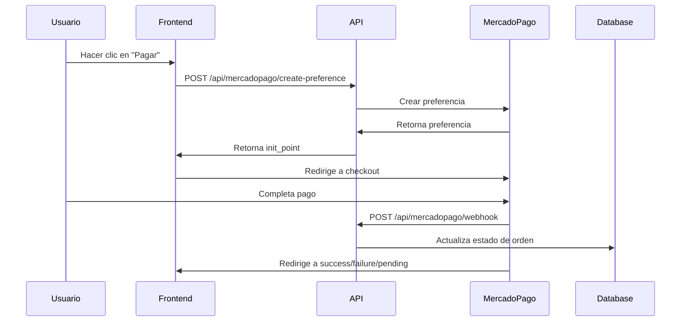

# 💳 Integración de Mercado Pago - TugoTugo

## 🚀 Configuración Completa

### 1. Variables de Entorno

Agrega estas variables a tu archivo `.env`:

```env
# Mercado Pago
NEXT_PUBLIC_MERCADOPAGO_PUBLIC_KEY="TEST-xxxxxxxx-xxxx-xxxx-xxxx-xxxxxxxxxxxx"
MERCADOPAGO_ACCESS_TOKEN="TEST-xxxxxxxxxxxxxxxxxxxxxxxxxxxxxxxx-xxxxxx-xxxxxxxxxxxxxxxxxxxxxxxxxxxxxxxx-xxxxxxxx"
MERCADOPAGO_WEBHOOK_SECRET="your-webhook-secret"
```

### 2. Endpoints API Disponibles

#### 🔧 Crear Preferencia de Pago
```
POST /api/mercadopago/create-preference
```

**Body:**
```json
{
  "items": [
    {
      "id": "pack_123",
      "title": "Pack de Comida Italiana",
      "description": "Pizza + Pasta + Bebida",
      "quantity": 1,
      "unit_price": 2500.00
    }
  ],
  "orderId": "order_abc123",
  "backUrls": {
    "success": "https://tugotug.com/payment/success",
    "failure": "https://tugotug.com/payment/failure",
    "pending": "https://tugotug.com/payment/pending"
  }
}
```

**Response:**
```json
{
  "id": "preference_id_123",
  "init_point": "https://www.mercadopago.com.ar/checkout/v1/redirect?pref_id=...",
  "sandbox_init_point": "https://sandbox.mercadopago.com.ar/checkout/v1/redirect?pref_id=..."
}
```

#### 🔍 Verificar Estado de Pago
```
GET /api/mercadopago/payment-status?payment_id=123456789
GET /api/mercadopago/payment-status?order_id=order_abc123
```

#### 🔔 Webhook (Automático)
```
POST /api/mercadopago/webhook
```

#### 💳 Obtener Métodos de Pago
```
GET /api/mercadopago/payment-methods
GET /api/mercadopago/payment-methods?type=credit_card
POST /api/mercadopago/payment-methods (método específico)
```

### 3. Componentes React

#### 🎯 Botón Simple de Pago

```tsx
import MercadoPagoButton from '@/components/payment/MercadoPagoButton';

const items = [
  {
    id: 'pack_1',
    title: 'Pack Especial',
    description: 'Comida deliciosa',
    quantity: 1,
    unit_price: 1500.00
  }
];

<MercadoPagoButton
  items={items}
  orderId="order_123"
  onSuccess={(preferenceId) => console.log('Pago iniciado:', preferenceId)}
  onError={(error) => console.error('Error:', error)}
>
  Pagar $1,500
</MercadoPagoButton>
```

#### 🛒 Checkout Completo

```tsx
import MercadoPagoCheckout from '@/components/payment/MercadoPagoCheckout';

<MercadoPagoCheckout
  items={items}
  orderId="order_123"
  onReady={() => console.log('Checkout listo')}
  onError={(error) => console.error('Error:', error)}
/>
```

### 4. Flujo de Pago



### 5. Estados de Pago

| Estado | Descripción | Acción |
|--------|-------------|---------|
| `approved` | Pago aprobado | Orden confirmada |
| `rejected` | Pago rechazado | Mostrar error |
| `pending` | Pago pendiente | Esperar confirmación |
| `in_process` | En proceso | Esperar resultado |
| `cancelled` | Cancelado | Orden cancelada |

### 6. Páginas de Resultado

- **Éxito**: `/payment/success` - Pago completado
- **Error**: `/payment/failure` - Pago rechazado/cancelado  
- **Pendiente**: `/payment/pending` - Pago en proceso

### 7. Base de Datos

Los campos agregados al modelo `Order`:

```prisma
model Order {
  // ... campos existentes
  
  // Campos de Mercado Pago
  paymentId        String?     // ID del pago de MercadoPago
  paymentStatus    String?     // Estado del pago
  paymentMethod    String?     // Método de pago
  paidAmount       Float?      // Monto pagado
}
```

### 8. Configuración de Webhook

En tu panel de MercadoPago:

1. Ve a **Integraciones** > **Webhooks**
2. Agrega la URL: `https://tu-dominio.com/api/mercadopago/webhook`
3. Selecciona eventos: `payment`

### 9. Entorno de Pruebas

#### Usuarios de Prueba
- **Comprador**: `test_user_123456789@testuser.com`
- **Vendedor**: `test_user_987654321@testuser.com`

#### Tarjetas de Prueba
```
Visa: 4509 9535 6623 3704
Mastercard: 5031 7557 3453 0604
CVV: 123
Vencimiento: 11/25
```

### 10. Seguridad

- ✅ Validación de webhooks con secret
- ✅ Verificación de usuario autenticado
- ✅ Sanitización de datos de entrada
- ✅ Logs de transacciones
- ✅ Manejo de errores

### 11. Monitoreo

```typescript
// Ejemplo de log personalizado
console.log(`Pago ${paymentInfo.status} para orden ${orderId}`, {
  paymentId: paymentInfo.id,
  amount: paymentInfo.transaction_amount,
  method: paymentInfo.payment_method_id,
  userId: session.user.id
});
```

### 12. Troubleshooting

#### Error: "Credenciales inválidas"
- Verifica que las variables de entorno estén configuradas
- Asegúrate de usar credenciales de TEST en desarrollo

#### Error: "Webhook no recibido"
- Verifica la URL del webhook en MercadoPago
- Revisa los logs del servidor
- Confirma que el endpoint esté accesible públicamente

#### Error: "Pago no actualizado en DB"
- Revisa los logs del webhook
- Verifica que el `external_reference` coincida con el `orderId`
- Confirma que la base de datos esté accesible

### 13. Próximos Pasos

- [ ] Implementar reembolsos
- [ ] Agregar pagos recurrentes
- [ ] Integrar con sistema de facturación
- [ ] Métricas y analytics de pagos
- [ ] Notificaciones push para pagos

---

## 🎯 Ejemplo Completo de Uso

Ver archivo: `src/app/example-checkout/page.tsx`
